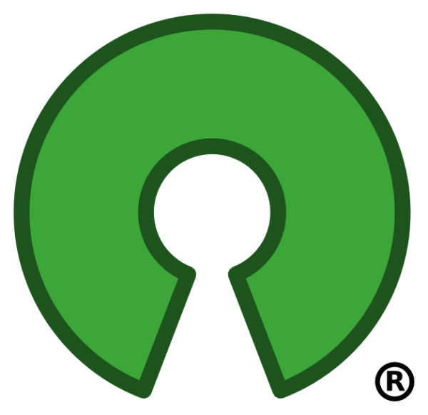

# IEEE Summer Of Code - Open Source Contribution Guide

<div align="center">
  
  <h2>Your first step into the world of Open Source 🚀</h2>
</div>


## 📚 Table of Contents

<table>
  <tr>
    <th>Topic</th>
    <th>Description</th>
    <th>Resources</th>
  </tr>
  <tr>
    <td><a href="#what-is-open-source">What is Open Source?</a></td>
    <td>Overview of OSS, licenses, and the culture</td>
    <td><a href="https://opensource.guide/how-to-contribute/">Open Source Guide</a></td>
  </tr>
  <tr>
    <td><a href="#git--github-basics">Git & GitHub Basics</a></td>
    <td>Intro to git, clone, commit, push, pull</td>
    <td><a href="https://docs.github.com/en/get-started">GitHub Docs</a></td>
  </tr>
  <tr>
    <td><a href="#forking-and-cloning">Forking and Cloning</a></td>
    <td>How to contribute via forks and remotes</td>
    <td><a href="https://docs.github.com/en/get-started/quickstart/fork-a-repo">GitHub Fork Guide</a></td>
  </tr>
  <tr>
    <td><a href="#issues-and-discussions">Issues and Discussions</a></td>
    <td>Raising and responding to issues</td>
    <td><a href="https://docs.github.com/en/issues/tracking-your-work-with-issues/about-issues">GitHub Issues</a></td>
  </tr>
  <tr>
    <td><a href="#pull-requests-prs">Pull Requests (PRs)</a></td>
    <td>Creating, linking, and reviewing PRs</td>
    <td><a href="https://docs.github.com/en/pull-requests/collaborating-with-pull-requests/proposing-changes-to-your-work-with-pull-requests/about-pull-requests">GitHub PR Guide</a></td>
  </tr>
  <tr>
    <td><a href="#writing-a-proposal">Writing a Proposal</a></td>
    <td>Structure and sample proposals for features</td>
    <td><a href="https://opensource.guide/how-to-contribute/#how-to-submit-a-contribution">Contribution Guide</a></td>
  </tr>
  <tr>
    <td><a href="#best-contribution-practices">Best Contribution Practices</a></td>
    <td>Clean commits, code quality, etiquette</td>
    <td><a href="https://github.com/firstcontributions/first-contributions">First Contributions</a></td>
  </tr>
  <tr>
    <td><a href="#installing-dependencies">Installing Dependencies</a></td>
    <td>Node, Python, Java, Docker, Rust, etc.</td>
    <td><a href="https://docs.github.com/en/repositories/working-with-files/managing-files/adding-a-file-to-a-repository">Adding Files</a></td>
  </tr>
</table>

## 🌟 What is Open Source?

<div align="center">
  
</div>

Open Source Software (OSS) is code that is designed to be publicly accessible—anyone can see, modify, and distribute the code as they see fit. Open source projects embrace principles of open exchange, collaborative participation, transparent processes, and community-oriented development.

### Key Concepts:
- **License**: Determines how the software can be used, modified and shared
- **Contributors**: Community members who help improve the project
- **Maintainers**: Organize and manage the project
- **Fork**: Personal copy of someone else's project
- **Community**: People who use and contribute to the project

<details>
<summary>📘 Popular Open Source Licenses</summary>

- **MIT License**: Short and permissive
- **GNU GPL**: Ensures derivatives remain open source
- **Apache License 2.0**: Grants patent rights
- **BSD License**: Similar to MIT but with variations

[Learn more about licenses](https://choosealicense.com/)
</details>

## 🔧 Git & GitHub Basics

<div align="center">
  
</div>

Git is a distributed version control system that allows developers to track changes in their code. GitHub is a platform that hosts Git repositories and adds collaboration features.

### Essential Git Commands:

```bash
# Clone a repository
git clone https://github.com/username/repository.git

# Create and switch to a new branch
git checkout -b feature-branch

# Add changes to staging
git add .

# Commit changes with a message
git commit -m "Add new feature"

# Push changes to remote repository
git push origin feature-branch

# Pull latest changes from remote
git pull origin main
```

<details>
<summary>🔍 Additional Git Resources</summary>

- [Interactive Git Learning](https://learngitbranching.js.org/)
- [Git Cheat Sheet](https://education.github.com/git-cheat-sheet-education.pdf)
- [Pro Git Book](https://git-scm.com/book/en/v2)
- [Git Visualizer](https://git-school.github.io/visualizing-git/)
</details>

## 🌱 Forking and Cloning


Forking creates your own copy of a repository on your GitHub account. This allows you to freely experiment with changes without affecting the original project.

### Steps to Fork and Clone:

1. **Fork the repository**: Click the "Fork" button at the top-right of any GitHub repository
2. **Clone your fork locally**:
   ```bash
   git clone https://github.com/YOUR-USERNAME/REPOSITORY-NAME.git
   ```
3. **Add the original repository as a remote (upstream)**:
   ```bash
   git remote add upstream https://github.com/ORIGINAL-OWNER/ORIGINAL-REPOSITORY.git
   ```
4. **Keep your fork in sync**:
   ```bash
   git fetch upstream
   git checkout main
   git merge upstream/main
   ```

<details>
<summary>💡 Forking Best Practices</summary>

- Always sync with the upstream repository before creating a new branch
- Create feature branches from an up-to-date main/master branch
- Never work directly on the main branch
- Use descriptive branch names (e.g., `fix-login-issue`, `add-dark-mode`)
</details>

## 📌 Issues and Discussions


Issues are a great way to keep track of tasks, enhancements, and bugs. They act as a shared to-do list for project contributors.

### Creating an Effective Issue:

```markdown
## Description
A clear description of the issue or feature request

## Steps to Reproduce (for bugs)
1. Step 1
2. Step 2
3. ...

## Expected Behavior
What should happen

## Actual Behavior
What actually happens

## Screenshots
If applicable

## Environment
- OS: [e.g., Windows 11]
- Browser: [e.g., Chrome 98]
- Version: [e.g., v1.2.3]
```

<details>
<summary>🏷️ Issue Labels and Their Meanings</summary>

- **bug**: Something isn't working
- **documentation**: Improvements or additions to documentation
- **enhancement**: New feature or request
- **good first issue**: Good for newcomers
- **help wanted**: Extra attention is needed
</details>

## 🚀 Pull Requests (PRs)

<div align="center">
  
</div>

Pull requests let you tell others about changes you've pushed to a branch in a repository. Once a pull request is opened, you can discuss and review the potential changes with collaborators.

### Creating a Pull Request:

1. **Push your changes to GitHub**:
   ```bash
   git push origin feature-branch
   ```
2. **Go to the original repository** and click "New Pull Request"
3. **Select your fork and the branch** with your changes
4. **Fill in the PR template** with a detailed description of changes
5. **Link to the issue** the PR addresses (e.g., "Fixes #123")
6. **Request reviewers** if appropriate

<details>
<summary>📝 PR Template Example</summary>

```markdown
## Description
Brief description of the changes

## Related Issue
Fixes #123

## Type of Change
- [ ] Bug fix
- [ ] New feature
- [ ] Breaking change
- [ ] Documentation update

## How Has This Been Tested?
Describe how you tested your changes

## Checklist
- [ ] My code follows the project's style guidelines
- [ ] I have performed a self-review of my code
- [ ] I have commented my code, particularly in hard-to-understand areas
- [ ] I have made corresponding changes to the documentation
- [ ] My changes generate no new warnings
```
</details>

## 📝 Writing a Good Proposal

For larger contributions or complex features, it's often beneficial to write a proposal first. This helps align expectations and get early feedback.

### Proposal Structure:

```markdown
# Feature Proposal: [Feature Name]

## Problem Statement
Describe the problem this feature will solve

## Goals
- Goal 1
- Goal 2
- ...

## Non-Goals
- What's explicitly out of scope

## Proposed Solution
Detailed description of the implementation approach

## Alternatives Considered
Other approaches and why they were rejected

## Implementation Timeline
- Week 1: [tasks]
- Week 2: [tasks]
- ...

## Metrics
How success will be measured
```

## 🌠 Best Contribution Practices

<div align="center">
  
</div>

Following best practices helps ensure your contributions are valuable and more likely to be accepted.

### Commit Messages:

```
type(scope): description

[optional body]

[optional footer]
```

Where:
- **type**: feat, fix, docs, style, refactor, test, chore
- **scope**: what area of code is affected
- **description**: short summary in present tense

### Code Quality:

- Follow the project's style guide
- Write tests for your code when applicable
- Keep changes focused and minimal
- Document new functions/methods
- Update relevant documentation

<details>
<summary>🤝 Community Etiquette</summary>

- Be respectful and considerate
- Be patient, especially with project maintainers
- Accept constructive criticism gracefully
- Help others where you can
- Give credit where credit's due
</details>

## 📦 Installing Dependencies

Most projects require setting up a development environment. Here are guides for common tech stacks:

### Node.js Projects
```bash
# Install NVM (Node Version Manager)
curl -o- https://raw.githubusercontent.com/nvm-sh/nvm/v0.39.3/install.sh | bash

# Install and use specific Node version
nvm install 16
nvm use 16

# Install dependencies
npm install
```

### Python Projects
```bash
# Create a virtual environment
python -m venv venv

# Activate the environment
# On Windows:
venv\Scripts\activate
# On Unix or MacOS:
source venv/bin/activate

# Install dependencies
pip install -r requirements.txt
```

### Docker-based Projects
```bash
# Install Docker
# Follow guide at https://docs.docker.com/get-docker/

# Build and run containers
docker-compose up -d
```

<details>
<summary>🔧 Other Development Environments</summary>

- **Java**: Use Maven (`mvn install`) or Gradle (`./gradlew build`)
- **Rust**: Use Cargo (`cargo build`)
- **Go**: Use Go modules (`go mod download`)
</details>

## 🔍 Finding Projects to Contribute To

<div align="center">
  
</div>

Not sure where to start? Here are some resources to find beginner-friendly projects:

- [IEEE SoC](https://www.ieeesoc.xyz/repos) - Our Summer long open source contribution event
- [Good First Issues](https://goodfirstissue.dev/) - Curated list of beginner-friendly issues
- [First Timers Only](https://www.firsttimersonly.com/) - Resources for first-time contributors
- [Up For Grabs](https://up-for-grabs.net/) - Projects with tasks specifically for new contributors
- [CodeTriage](https://www.codetriage.com/) - Help out your favorite open source projects
- [Hacktoberfest](https://hacktoberfest.digitalocean.com/) - Annual event promoting open source contributions


<div align="center">
  <p>Crafted with ❤️ for Open Source Contributors</p>
  <p>© 2025 IEEE Society</p>
</div>
