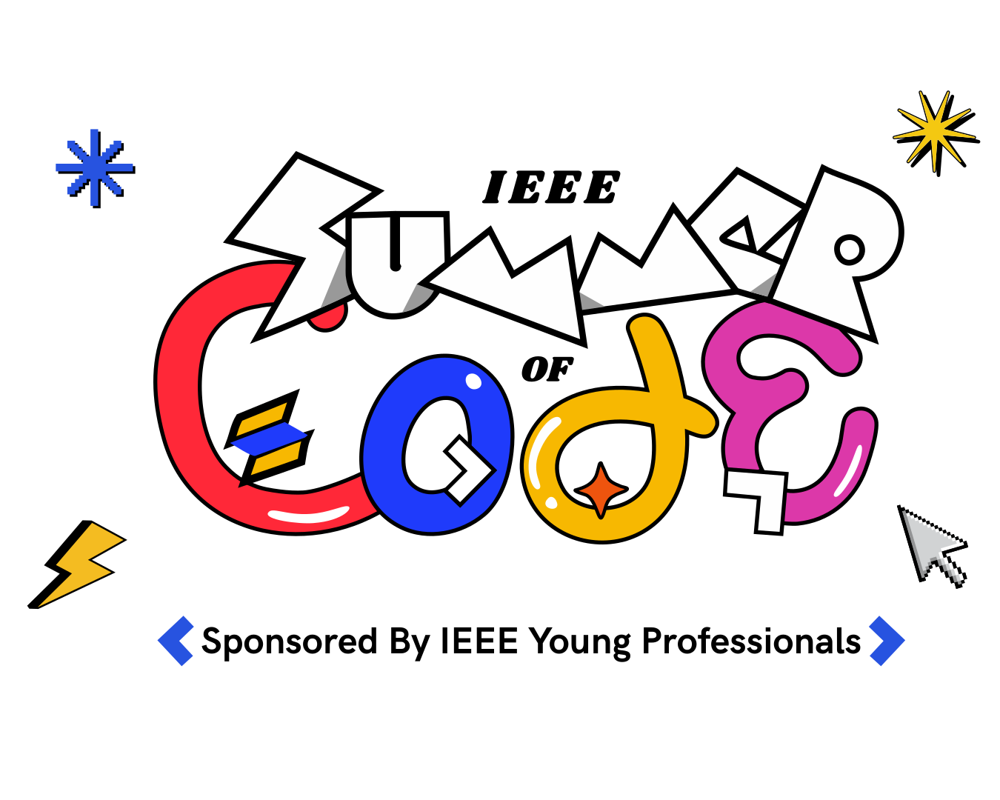

<!DOCTYPE html>
<html lang="en">
<head>
  <meta charset="UTF-8" />
  <meta name="viewport" content="width=device-width, initial-scale=1.0"/>
  <title>IEEE Soc | Open Source Starter Guide</title>
  
</head>
<body>

  <header>
    
    <h1>IEEE Summer Of Code - Open Source Contribution Guide</h1>
    
<strong>Your first step into the world of Open Source 🚀</strong>

  </header>

  <section>
    
<h2>📚 Table of Contents</h2>

    <table>
      <tr>
        <th>Topic</th>
        <th>Description</th>
      </tr>
      <tr>
        <td>What is Open Source?</td>
        <td>Overview of OSS, licenses, and the culture</td>
      </tr>
      <tr>
        <td>Git & GitHub Basics</td>
        <td>Intro to git, clone, commit, push, pull</td>
      </tr>
      <tr>
        <td>Forking and Cloning</td>
        <td>How to contribute via forks and remotes</td>
      </tr>
      <tr>
        <td>Issues and Discussions</td>
        <td>Raising and responding to issues</td>
      </tr>
      <tr>
        <td>Pull Requests (PRs)</td>
        <td>Creating, linking, and reviewing PRs</td>
      </tr>
      <tr>
        <td>Writing a Proposal</td>
        <td>Structure and sample proposals for features</td>
      </tr>
      <tr>
        <td>Best Contribution Practices</td>
        <td>Clean commits, code quality, etiquette</td>
      </tr>
      <tr>
        <td>Installing Dependencies</td>
        <td>Node, Python, Java, Docker, Rust, etc.</td>
      </tr>
    </table>
  </section>

  <section>
    
<h2>🔧 Git & GitHub Basics</h2>

    
Git is a distributed version control system. Here are some basic commands:

    <pre>
git clone https://github.com/user/repo.git
git checkout -b my-feature
git add .
git commit -m "Add new feature"
git push origin my-feature
    </pre>
  </section>

  <section>
    
<h2>🌱 Forking and Cloning</h2>

    
Forking creates your own copy of a repository. After forking, you can clone it locally and set upstream:

    <pre>
git remote add upstream https://github.com/original/repo.git
git fetch upstream
git merge upstream/main
    </pre>
  </section>

  <section>
    
<h2>📌 Understanding Issues</h2>

    
Issues help maintainers and contributors track bugs and feature requests.

    <ul>
      <li>Use descriptive titles</li>
      <li>Include screenshots/logs if applicable</li>
      <li>Label issues appropriately</li>
    </ul>
  </section>

  <section>
    
<h2>🚀 Pull Requests</h2>

    
A pull request lets you propose changes. Ensure your PR:

    <ul>
      <li>Is linked to an issue if needed</li>
      <li>Has a clean commit history</li>
      <li>Passes all tests or CI checks</li>
    </ul>
  </section>

  <section>
    
<h2>📝 Writing a Good Proposal</h2>

    
Proposals should include:

    <ul>
      <li>Problem Statement</li>
      <li>Goals</li>
      <li>Proposed Solution</li>
      <li>Timeline</li>
    </ul>
  </section>

  <section>
    
<h2>🌟 Best Practices</h2>

    <ul>
      <li>Follow the repo's style guide</li>
      <li>Write meaningful commit messages</li>
      <li>Be respectful in discussions</li>
    </ul>
  </section>

  <section>
    
<h2>📦 Installing Dependencies</h2>

    
Setup guides for different tech stacks:

    <ul>
      <li><strong>Node.js</strong>: Use <code>nvm</code>, <code>npm install</code></li>
      <li><strong>Python</strong>: Use <code>venv</code>, <code>pip install -r requirements.txt</code></li>
      <li><strong>Docker</strong>: Use <code>docker build</code>, <code>docker-compose</code></li>
      <li><strong>Rust</strong>: Use <code>rustup</code> and <code>cargo</code></li>
    </ul>
  </section>

  <footer>
    © 2025 IEEE Society | Crafted with ❤️ for OSS contributors
  </footer>

</body>
</html>
